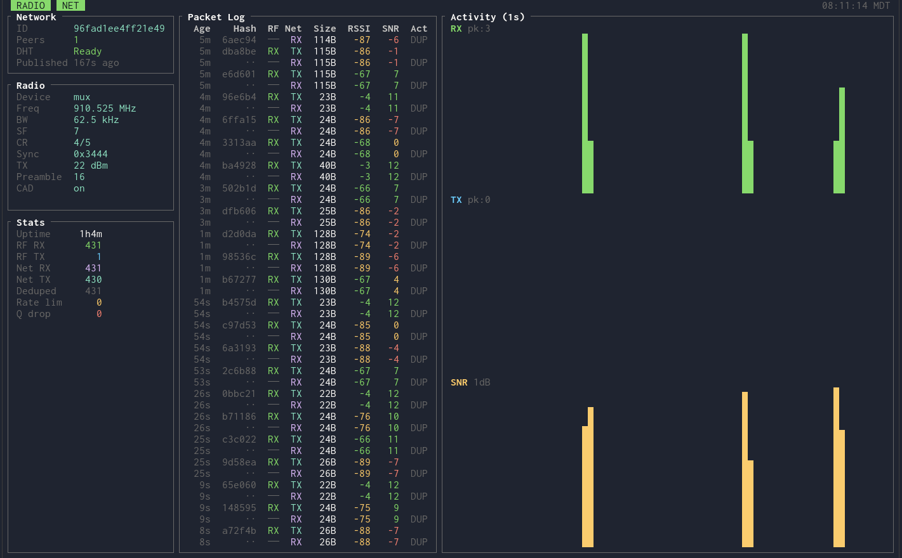

# donglora-bridge

[](https://github.com/swaits/donglora-bridge/actions/workflows/ci.yml)
[](LICENSE)


**donglora-bridge** relays raw LoRa packets over the internet. Every packet your
radio hears is forwarded to every other bridge running the same passphrase, and
their radios retransmit it locally. Because it operates on raw packets, it works
with any protocol built on LoRa --
[Meshtastic](https://meshtastic.org/),
[MeshCore](https://github.com/rocketgithub/meshcore-firmware),
or anything else -- simultaneously and without configuration. If your radio can
hear it, the bridge will relay it.

[LoRa](https://en.wikipedia.org/wiki/LoRa) is a long-range, low-power wireless
modulation used by off-grid mesh networks. A single radio might cover a few
kilometers. This bridge removes that limit, extending a local LoRa network
across a larger geographic area.

There is no central server. Bridges discover each other automatically using the
[Mainline DHT](https://en.wikipedia.org/wiki/Mainline_DHT) and communicate
through an encrypted peer-to-peer gossip swarm.



## What you need

### 1. A DongLoRa radio

[DongLoRa](https://github.com/swaits/donglora) is open-source firmware that
turns a supported LoRa development board (such as a Heltec WiFi LoRa 32 or
similar ESP32+SX1262 board) into a USB LoRa dongle. You will need to:

1. **Get a board** -- any ESP32 board with an SX1262 LoRa radio that DongLoRa
   supports. See the [DongLoRa README](https://github.com/swaits/donglora) for
   the full list.
2. **Flash the DongLoRa firmware** onto the board. Instructions are in the
   DongLoRa repository.
3. **Plug it in via USB**. The board appears as a serial device
   (e.g. `/dev/ttyACM0` on Linux).

### 2. (Optional) donglora-mux

The bridge works fine without the mux -- it connects directly to the USB device.
The mux is only needed if you want multiple programs to share a single DongLoRa
radio at the same time (e.g. running two bridges with different configs, or a
bridge alongside another donglora-client program).

```sh
cargo install donglora-mux
```

Run `donglora-mux` before starting the bridge. The bridge auto-detects the mux
when it's running and falls back to direct USB serial when it's not.

### 3. donglora-bridge (this project)

Install via cargo:

```sh
cargo install donglora-bridge
```

Or via [mise](https://mise.jdx.dev/):

```sh
mise use -g cargo:donglora-bridge
```

Or build from source:

```sh
git clone https://github.com/swaits/donglora-bridge.git
cd donglora-bridge
cargo build --release
```

Requires Linux. macOS may work but is untested.

## Quick start

### 1. Plug in your DongLoRa board and (optionally) start the mux

```sh
donglora-mux          # optional -- skip if not sharing the radio
```

### 2. Run the bridge

```sh
donglora-bridge
```

On first run, an interactive wizard walks you through configuration:

- **Passphrase** (required) -- every bridge using the same passphrase joins the
  same network. Pick something unique to your group.
- **Radio settings** -- frequency, bandwidth, spreading factor, etc. The
  defaults match MeshCore US/Canada recommended values. If you're bridging a
  MeshCore network, just press Enter through these.

The config is saved to `~/.config/donglora-bridge/config.toml`. To change it
later, run `donglora-bridge config`.

### 3. That's it

The TUI shows real-time stats. On another machine (or continent), repeat the
same steps with the same passphrase. The two bridges will discover each other
via DHT and start relaying packets within seconds.

```sh
donglora-bridge                    # TUI mode (default)
donglora-bridge --log-only         # headless mode (structured logs to stdout)
donglora-bridge --config path.toml # custom config file
donglora-bridge config             # re-run setup wizard
```

### Running multiple bridges

To run more than one bridge on the same machine (e.g. bridging two separate
MeshCore networks), create a config file per bridge and run each with
`--config`:

```sh
donglora-bridge --config ~/bridge-network-a.toml
donglora-bridge --config ~/bridge-network-b.toml
```

Each config can specify a different passphrase, different radio settings, and
(if using the mux) share the same radio. Without the mux, each bridge needs its
own USB dongle and an explicit `port` in its config to avoid both trying to open
the same device.

## Features

- **Gossip swarm** -- broadcast packets via [iroh-gossip](https://github.com/n0-computer/iroh), a QUIC-based overlay network
- **Zero-config peer discovery** -- automatic bootstrapping via BitTorrent mainline DHT ([BEP44](http://bittorrent.org/beps/bep_0044.html) mutable items)
- **Content-hash deduplication** -- blake3 hashing suppresses duplicate packets across all bridges
- **Air-time-aware rate limiting** -- token bucket calculated from LoRa radio parameters (Semtech LoRa time-on-air formula)
- **Real-time terminal UI** -- network status, radio config, packet log, activity sparklines
- **Resilient radio connection** -- exponential backoff reconnection with liveness pings
- **Headless mode** -- structured logs to stdout for servers (`--log-only`)
- **Interactive setup wizard** -- guided first-run configuration
- **Shared passphrase security** -- all cryptographic keys derived deterministically from a single passphrase

## TUI overview

| Panel | Content |
|-------|---------|
| **Network** | Topic ID, peer count, DHT status, last publish time |
| **Radio** | Device, frequency, bandwidth, SF, CR, sync word, TX power, preamble, CAD |
| **Stats** | Uptime, RF/Net RX/TX, dedup hits, rate limit drops, queue drops |
| **Packet Log** | Scrolling log: age, hash, RF/Net direction, size, RSSI, SNR, action |
| **Activity** | Sparkline charts: RX rate, TX rate, average SNR (1-second buckets, 5-minute window) |

Press `q` or `Ctrl+C` to shut down gracefully.

## Configuration

Default location: `~/.config/donglora-bridge/config.toml`

```toml
[radio]
# port = "/dev/ttyACM0"   # serial port (omit for auto-detect: tries mux, then USB)
frequency = 910525000      # Hz (default: 910.525 MHz)
bandwidth = "62.5kHz"      # 7.8kHz, 10.4kHz, 15.6kHz, 20.8kHz, 31.25kHz,
                           # 41.7kHz, 62.5kHz, 125kHz, 250kHz, 500kHz
spreading_factor = 7       # 7-12
coding_rate = 5            # 5-8 (meaning 4/5 to 4/8)
sync_word = 0x3444         # hex, 2 bytes
tx_power = "22"            # dBm integer or "max"
preamble = 16              # symbols
cad = true                 # channel activity detection

[bridge]
passphrase = "your-shared-secret"  # REQUIRED: all bridges with same passphrase join the same swarm
dedup_window_secs = 300            # duplicate suppression window (default: 5 minutes)
tx_queue_size = 32                 # max pending radio TX packets
# rate_limit_pps = 5.0            # optional: override calculated TX rate (packets/sec)
# log_file = "/path/to/bridge.log"  # optional: override log path
```

Default radio settings match MeshCore US/Canada recommended parameters.

## How it works

### Passphrase key derivation

A single passphrase deterministically derives three values:

1. **Topic ID** -- `blake3(APP_PREFIX + passphrase)` -- identifies the gossip swarm
2. **DHT signing key** -- ed25519 from `SHA-256(APP_PREFIX + "sign:" + passphrase)` -- authenticates DHT records
3. **DHT salt** -- first 20 bytes of `SHA-256(APP_PREFIX + "salt:" + passphrase)` -- namespaces the DHT key

All nodes with the same passphrase compute identical keys and automatically join
the same network.

### Gossip swarm

Each bridge creates an ephemeral iroh endpoint (fresh ed25519 identity per
launch) and subscribes to the derived topic. Radio packets are wrapped in a
`GossipFrame` (32-byte sender ID + RSSI + SNR + payload) and broadcast to all
neighbors. Received frames are decoded and queued for radio transmission.

### DHT peer discovery

Peers find each other through BitTorrent's mainline DHT using BEP44 mutable
items. Peer lists are encoded as `[count:u16 LE][id:32B]...` (max 27 peers per
record to stay under the 1000-byte value limit).

**When alone** (no neighbors): reads DHT every 3 seconds, merge-publishes every
30 seconds (preserves existing peers, never destructive).

**When connected**: relaxed 5-minute heartbeat with random jitter. Publishes
self + live neighbors only (purges stale peers).

**On shutdown**: publishes neighbors without self, so other nodes can still
bootstrap from live peers.

### Deduplication

Every packet payload is hashed with blake3 (32 bytes). A time-bounded cache
(default 300s, pruned every 30s) suppresses duplicates from both radio and
gossip directions.

### Rate limiting

A token bucket rate limiter prevents radio channel saturation. The rate is
calculated from the LoRa air time formula (Semtech SX1276):

```
air_time = preamble_time + payload_symbol_count * symbol_time
rate = 0.5 / air_time  (50% duty cycle target)
```

Default burst allowance is 3 packets. The rate can be manually overridden with
`rate_limit_pps` in the config.

### Radio communication

A dedicated blocking thread communicates with the DongLoRa hardware via
`donglora-client`. Features:

- **Config negotiation**: reads existing config first; only sets if needed
- **Exponential backoff reconnection**: 250ms to 5s, resets after 5s of uptime
- **Liveness pings**: every 2s of idle, detects silently-dead connections
- **SNR filtering**: drops packets below the demodulation floor

### Architecture

```
                        ┌─────────────────────────────────────┐
                        │           donglora-bridge           │
                        │                                     │
  DongLoRa    ┌────────┐│  ┌────────┐   ┌──────┐   ┌───────┐  │    Internet
  USB dongle◄─┤ Radio  ├┤◄─┤ Router ├──►│Gossip├──►│  iroh ├──┤◄──► Other
              │ Thread ││─►│ (dedup ││  │Swarm │   │  QUIC │  │    Bridges
              └────────┘│  │  rate  ││  └──┬───┘   └───────┘  │
                        │  │  limit)│|     │                  │
                        │  └────────┘│  ┌──┴───┐             │
                        │     ▲      │  │ DHT  │             │
                        │     │      │  │(peer │             │
                        │  ┌──┴──┐   │  │disc.)│             │
                        │  │ TUI │   │  └──────┘             │
                        │  └─────┘   │                       │
                        └─────────────────────────────────────┘
```

## Testing

```sh
cargo test                      # unit tests + property tests (proptest)
cargo clippy --all-targets      # lint check (pedantic + nursery)
cargo fmt --check               # format check
cargo mutants                   # mutation testing (install: cargo install cargo-mutants)
cargo +nightly fuzz run fuzz_gossip_frame_decode   # fuzz testing (requires nightly)
cargo +nightly fuzz run fuzz_decode_peer_list
```

## Troubleshooting

| Symptom | Cause | Fix |
|---------|-------|-----|
| "passphrase is required" | Empty or placeholder passphrase | Run `donglora-bridge config` |
| No peers found | Passphrase mismatch or firewall | Check passphrase matches; iroh uses QUIC (UDP), DHT uses UDP |
| Radio disconnected | USB dongle unplugged or mux crash | Check USB connection; bridge will auto-reconnect |
| Yellow `!` on radio fields | Mux has different radio config | Another client set different params; bridge adopts mux config |
| Log file location | Default path | `~/.local/state/donglora-bridge/bridge.log` |

## License

[MIT](LICENSE)
